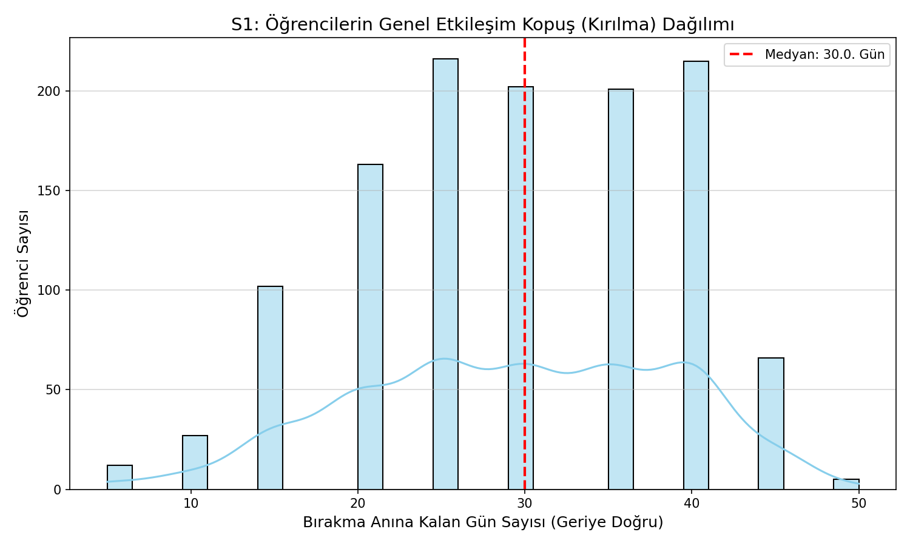
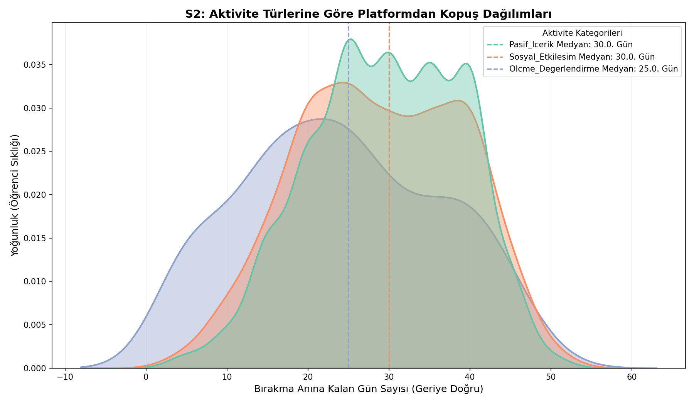
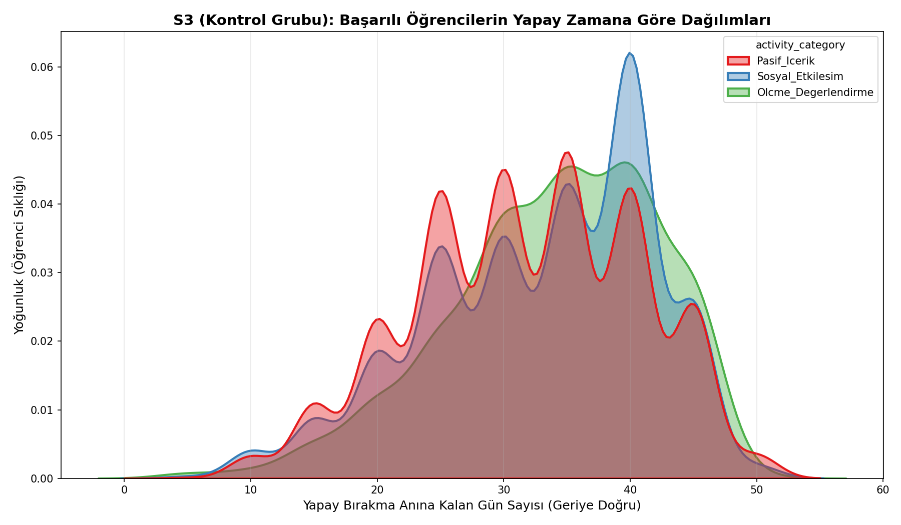

# Çevrimiçi Öğrencilerde Davranışsal Çekilmenin Anatomisi

> **"Kim bırakır?" değil — "Nasıl bırakır?"**

[](https://python.org)
[](https://pandas.pydata.org)
[](https://centre-borelli.github.io/ruptures-docs/)
[](https://scipy.org)
[](https://powerbi.microsoft.com)
[](https://analyse.kmi.open.ac.uk/open-dataset)

---

## Projeye Genel Bakış

Çevrimiçi eğitimde bırakma araştırmaları genellikle iki soruya odaklanır: **Kim bırakacak?** (tahmin modeli) ya da **Ne zaman bırakacak?** (zamanlama analizi). Bu proje farklı bir soruyu sorar:

**Bırakmak bir an mıdır, yoksa bir süreç mi? Ve bu süreç davranışsal olarak nasıl görünür?**

OULAD'ın bırakma tarihini gün düzeyinde kaydetmesi kritik bir avantaj sağlar. Bu özellik sayesinde her öğrencinin tıklama davranışını **bırakma tarihine göre hizalayarak** (event-aligned analiz) bireysel kopuş anını tespit etmek mümkün hale gelir.

---

## Ana Bulgular



| Bulgu | Değer |
|---|---|
| Medyan davranışsal kopuş | Bırakmadan **30 gün önce** |
| Kopuş dağılımı | **Bimodal** — iki farklı öğrenci profili |
| En erken düşen aktivite | **Ölçme & Değerlendirme** (quiz/sınav) — 25. gün |
| Kontrol grubu farkı | **10 gün** (istatistiksel olarak anlamlı, p < 0.001) |
| Tinto hipotezi | ❌ Reddedildi |

### Neden önemli?

Bırakanlar quiz ve sınav aktivitelerini, **başarılı öğrencilere kıyasla 10 gün daha erken bırakıyor.** Bu fark yönsel olarak da tamamen zıt — ve tesadüfle açıklanamaz.

Bu bulgu, erken müdahale sistemleri için pratik bir sinyal sunar: **quiz'den çekilen öğrenci, platformdan çekilmeden önce yakalanabilir.**

---

## Teorik Çerçeve

Proje, **Tinto'nun Entegrasyon Modeli'ni** (1975, 1993) test etmek üzere tasarlandı.

> Tinto'ya göre sosyal entegrasyon (forum, işbirliği) kırılması, akademik entegrasyon kırılmasından önce gerçekleşir.

Bu hipotez üç gerekçeyle reddedildi ve yerine **Bandura'nın Öz-Yeterlilik Teorisi** ile tutarlı alternatif bir bulgu ortaya çıktı: davranışsal kopuş sosyal değil, **akademik boyuttan** başlamaktadır.

---

## Metodoloji



### Pipeline

```
Ham Veri (10M+ tıklama logu)
    │
    ▼
Aktivite Kategorizasyonu (20 tür → 3 makro kategori)
    │
    ▼
Event-Aligned Zaman Serisi (bırakma = t=0, geriye 60 gün)
    │
    ▼
7 Günlük Hareketli Ortalama (gürültü azaltma)
    │
    ▼
PELT Algoritması (bireysel kırılma noktası tespiti)
    │
    ├── Bırakanlar (S1 & S2)
    └── Kontrol Grubu — Başarılı öğrenciler (S3)
            │
            ▼
    Mann-Whitney U Testi + BH Düzeltmesi
```

### Aktivite Kategorileri

| Kategori | Aktivite Türleri |
|---|---|
| `Pasif_Icerik` | resource, url, page, oucontent, homepage, glossary... |
| `Sosyal_Etkilesim` | forumng, ouwiki, oucollaborate, ouilluminate |
| `Olcme_Degerlendirme` | quiz, questionnaire, externalquiz |

### Kontrol Grubu Tasarımı

Başarılı öğrencilere, kendi ders/dönemleri için bırakanların **medyan bırakma günü** yapay çapa olarak atandı ve aynı pipeline uygulandı. Bu tasarım, tespit edilen sinyalin bırakanlara özgü olup olmadığını test eder.



---

## Sonuçlar

| Araştırma Sorusu | Sonuç |
|---|---|
| **S1:** Ne zaman kopuluyor? | Medyan 30 gün; dağılım bimodal → en az 2 farklı kopuş profili |
| **S2:** Hangi aktivite önce düşüyor? | Tinto reddedildi. `Olcme_Degerlendirme` tek ayrışan kategori (25. gün) |
| **S3:** Sinyal bırakanlara özgü mu? | Evet — 10 günlük fark, p < 0.001, yönsel zıtlık |

---

## Dashboard

Power BI ile oluşturulan dashboard dört analiz ekranı içerir:

<!-- Dashboard görsellerini buraya ekle: assets/dashboard_genel.png -->

| Ekran | İçerik |
|---|---|
| Genel Bakış | Bırakma oranı, final sonuç dağılımı, modüle göre bırakma |
| Demografik Profil | Yoksulluk düzeyi, eğitim seviyesi, yaş/cinsiyet, önceki deneme sayısı |
| Bırakma Zamanlaması | Erken/geç bırakan dağılımı, kayıt zamanına göre bırakma |
| Modül Karşılaştırması | Modüller arası bırakma oranı ve öğrenci hacmi |

---

## Repo Yapısı

```
oulad-dropout-anatomy/
│
├── oulad_pipeline.py          # Baştan sona çalışan analiz pipeline'ı
├── OULAD.ipynb                # Keşifsel analiz notebook'u
│
├── outputs/                   # Pipeline çıktıları (grafikler + CSV)
│   ├── s1_kirilma_dagilimi.png
│   ├── s2_aktivite_kopus_dagilimi.png
│   ├── s3_kontrol_grubu_dagilimi.png
│   ├── istatistiksel_test_sonuclari.csv
│   └── modul_bazli_test_sonuclari.csv
│
├── assets/                    # README görselleri
│
├── OULAD_Dashboard.pbix       # Power BI dashboard (veri dahil)
└── OULAD_Dokumantasyon.pdf    # Teknik ve akademik detaylı dokümantasyon
```

---

## Çalıştırma

**1. Bağımlılıkları yükle**
```bash
pip install pandas numpy matplotlib seaborn ruptures scipy statsmodels
```

**2. Veri setini indir**

OULAD veri setini [buradan](https://analyse.kmi.open.ac.uk/open-dataset) indirip aşağıdaki CSV dosyalarını proje klasörüne koy:

```
studentVle.csv
studentRegistration.csv
studentInfo.csv
vle.csv
courses.csv
```

**3. Pipeline'ı çalıştır**
```bash
python oulad_pipeline.py
```

Çıktılar otomatik olarak `outputs/` klasörüne kaydedilir.

---

## Sınırlılıklar

- Bulgular **betimleyicidir** — nedensellik iddiası taşımaz
- Veri 2013-2014 dönemine ait; Open University VLE'sine özgü
- Forum tıklaması okuma/yazma ayrımı yapılamıyor; aktif sosyal katılım tam ölçülemiyor
- Gözlemlenemeyen faktörler (iş kaybı, sağlık) sessiz bırakanları etkileyebilir

---

## Veri Seti Lisansı ve Atıf

Bu repoda yer alan OULAD veri dosyaları (`studentRegistration.csv`, `studentInfo.csv`, `vle.csv`, `courses.csv`) aşağıdaki çalışmadan alınmıştır:

> Kuzilek J., Hlosta M., Zdrahal Z. *Open University Learning Analytics Dataset.* Sci. Data 4:170171, doi: [10.1038/sdata.2017.171](https://doi.org/10.1038/sdata.2017.171) (2017).

Veri seti [Creative Commons Attribution 4.0 International (CC BY 4.0)](https://creativecommons.org/licenses/by/4.0/) lisansı ile dağıtılmaktadır.

---

## Kaynaklar

- Tinto, V. (1975, 1993). *Leaving College: Rethinking the Causes and Cures of Student Attrition.*
- Bandura, A. (1997). *Self-Efficacy: The Exercise of Control.*
- Fredricks, J. A., Blumenfeld, P. C., & Paris, A. H. (2004). School engagement: Potential of the concept.
- Kuzilek, J., Hlosta, M., & Zdrahal, Z. (2017). [Open University Learning Analytics Dataset.](https://doi.org/10.1038/sdata.2017.171) *Scientific Data.*
- [ruptures — Kırılma Noktası Tespiti Kütüphanesi](https://centre-borelli.github.io/ruptures-docs/)
